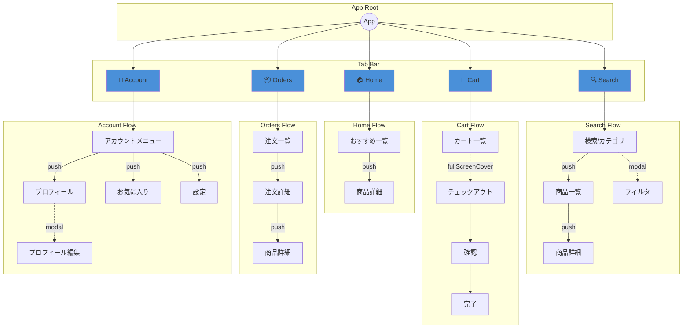
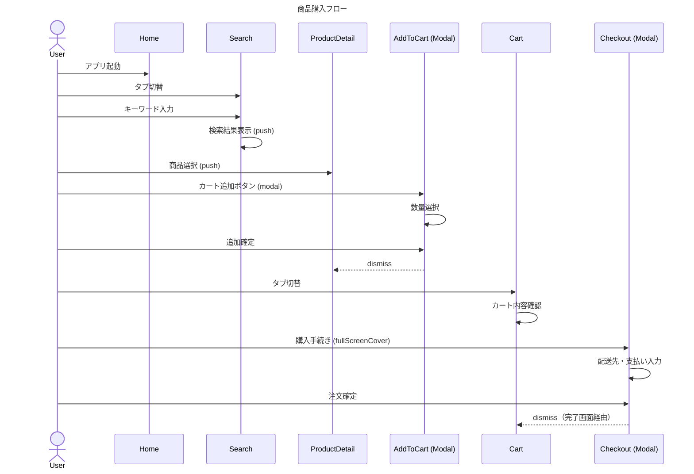

# 成果物テンプレート

最終成果物として出力するドキュメントのテンプレート集。

## A. IA成果物

### A1. コンテンツモデル（YAML形式）

```yaml
# コンテンツモデル定義
# アプリ名: [アプリ名]
# 更新日: [日付]

entities:
  - name: "[エンティティ名]"
    description: "[説明]"
    attributes:
      - name: "[属性名]"
        type: "[型]"  # String, Int, UUID, Decimal, Date, Bool, Enum[], [Array]
        required: true/false
        searchable: true/false  # 検索対象か
        filterable: true/false  # フィルタ対象か
    display:
      list_view: ["表示する属性"]
      detail_view: "all" or ["表示する属性"]
      card_view: ["カード表示用属性"]  # オプション

relations:
  - source: "[エンティティA]"
    target: "[エンティティB]"
    type: "1:1" | "1:N" | "N:1" | "N:N"
    via: "[中間エンティティ]"  # N:Nの場合
    navigation: true/false  # 画面遷移に使用するか
    label: "[関係の名前]"
    bidirectional: true/false

hierarchy:
  # 画面遷移の親子関係として使用する階層
  - path: "[親] → [子] → [孫]"
    navigation_type: push
    reasoning: "[この階層にする理由]"
```

### A2. 情報階層マップ（Mermaid形式）



### A3. 命名規則（表形式）

```markdown
# 命名規則

## タブ名
| タブ | 日本語 | 英語 | アイコン | 備考 |
|------|--------|------|---------|------|
| Home | ホーム | Home | house | - |
| Search | 検索 | Search | magnifyingglass | - |
| Cart | カート | Cart | cart | バッジ表示 |
| Orders | 注文 | Orders | shippingbox | - |
| Account | アカウント | Account | person | - |

## 画面タイトル規則
| パターン | 規則 | 例 |
|----------|------|-----|
| 一覧画面 | 複数形名詞 | 「商品」「注文履歴」 |
| 詳細画面 | エンティティ名 or 固有名 | 「商品詳細」→「[商品名]」 |
| 作成画面 | 「新規[対象]」 | 「新規住所」 |
| 編集画面 | 「[対象]を編集」 | 「プロフィールを編集」 |
| 設定画面 | 設定項目名 | 「通知設定」「プライバシー」 |

## アクション名規則
| カテゴリ | 動詞 | 例 |
|----------|------|-----|
| 追加系 | 追加、作成、新規 | 「カートに追加」「住所を追加」 |
| 編集系 | 編集、変更 | 「編集」「数量を変更」 |
| 削除系 | 削除、取り消し | 「削除」「注文を取り消し」 |
| 確定系 | 保存、確定、注文 | 「保存」「注文を確定」 |
| 取消系 | キャンセル、閉じる | 「キャンセル」「閉じる」 |
```

---

## B. 画面＆遷移成果物

### B1. 画面インベントリ（表形式）

```markdown
# 画面インベントリ

## Home タブ
| 画面ID | 画面名 | 目的 | 主要要素 | 入口 | 出口 |
|--------|--------|------|---------|------|------|
| home_main | ホーム | パーソナライズされた情報表示 | おすすめ、最近閲覧、セール | タブ選択 | push→商品詳細 |
| home_product_detail | 商品詳細 | 商品の詳細表示 | 画像、価格、説明、購入ボタン | Home→push | back、modal→カート追加 |

## Search タブ
| 画面ID | 画面名 | 目的 | 主要要素 | 入口 | 出口 |
|--------|--------|------|---------|------|------|
| search_main | 検索 | 商品検索・カテゴリ閲覧 | 検索バー、カテゴリグリッド | タブ選択 | push→一覧、modal→フィルタ |
| search_results | 検索結果 | 検索/カテゴリの結果表示 | 商品リスト、フィルタボタン | 検索→push | push→詳細、back |
| search_product_detail | 商品詳細 | 商品の詳細表示 | （home_product_detailと同構成） | 一覧→push | back、modal→カート追加 |
| search_filter | フィルタ | 絞り込み条件設定 | 価格範囲、カテゴリ、ソート | 一覧→modal | 適用/キャンセル→dismiss |

## Cart タブ
| 画面ID | 画面名 | 目的 | 主要要素 | 入口 | 出口 |
|--------|--------|------|---------|------|------|
| cart_main | カート | 購入予定商品の確認 | 商品リスト、合計、購入ボタン | タブ選択 | fullScreenCover→チェックアウト |
| cart_checkout | チェックアウト | 購入手続き | 配送先、支払い、確認 | カート→fullScreenCover | 完了→dismiss、キャンセル→dismiss |

## Orders タブ
| 画面ID | 画面名 | 目的 | 主要要素 | 入口 | 出口 |
|--------|--------|------|---------|------|------|
| orders_list | 注文履歴 | 過去の注文一覧 | 注文リスト、ステータス | タブ選択 | push→詳細 |
| orders_detail | 注文詳細 | 注文の詳細確認 | 商品、配送状況、合計 | 一覧→push | back、push→商品詳細 |

## Account タブ
| 画面ID | 画面名 | 目的 | 主要要素 | 入口 | 出口 |
|--------|--------|------|---------|------|------|
| account_main | アカウント | ユーザー設定メニュー | プロフィール、設定項目 | タブ選択 | push→各設定 |
| account_profile | プロフィール | ユーザー情報表示 | 名前、メール、写真 | メニュー→push | back、modal→編集 |
| account_favorites | お気に入り | お気に入り商品一覧 | 商品リスト | メニュー→push | push→詳細、back |
| account_settings | 設定 | アプリ設定 | 通知、プライバシー等 | メニュー→push | back |

## 認証（Modal）
| 画面ID | 画面名 | 目的 | 主要要素 | 入口 | 出口 |
|--------|--------|------|---------|------|------|
| auth_login | ログイン | 認証 | ID/PW入力、SNSログイン | 要認証時→fullScreenCover | 成功→dismiss、新規→SignUp |
| auth_signup | 新規登録 | アカウント作成 | 入力フォーム | ログイン→push | 完了→ログイン画面、back |
```

### B2. 遷移ルール表（表形式）

```markdown
# 遷移ルール表

## Push遷移（階層掘り下げ）
| From | To | トリガ | 戻り方 | 状態保持 |
|------|-----|--------|--------|---------|
| search_main | search_results | カテゴリ選択/検索実行 | back button | 検索条件保持 |
| search_results | search_product_detail | セル選択 | back button | スクロール位置保持 |
| orders_list | orders_detail | セル選択 | back button | 一覧位置保持 |
| account_main | account_profile | プロフィール選択 | back button | - |
| account_main | account_favorites | お気に入り選択 | back button | - |

## Modal遷移（文脈切り替え）
| From | To | トリガ | Presentation | 閉じ方 | 破棄確認 |
|------|-----|--------|--------------|--------|---------|
| search_results | search_filter | フィルタボタン | sheet(.medium) | 適用/キャンセル | 不要 |
| account_profile | profile_edit | 編集ボタン | sheet | 保存/キャンセル | 変更時のみ |
| cart_main | cart_checkout | 購入ボタン | fullScreenCover | 完了/キャンセル | 入力途中時 |
| any | auth_login | 要認証操作 | fullScreenCover | 成功/キャンセル | 不要 |
| product_detail | add_to_cart | カート追加 | sheet(.medium) | 追加/キャンセル | 不要 |

## Tab切り替え
| From Tab | To Tab | トリガ | 状態 |
|----------|--------|--------|------|
| any | any | タブバー選択 | 両タブの状態を保持 |
```

### B3. ユーザーフロー（Mermaid Sequence図）



### B4. iPhone/iPad適応方針（表形式）

```markdown
# iPhone/iPad適応方針

## デバイス別構成
| 環境 | Size Class | ナビゲーション構成 |
|------|-----------|------------------|
| iPhone Portrait | Compact Width | NavigationStack |
| iPhone Landscape | Compact Width | NavigationStack |
| iPad Portrait | Regular Width | NavigationSplitView (2列) |
| iPad Landscape | Regular Width | NavigationSplitView (2-3列) |
| iPad Split View | Compact Width | NavigationStack |

## タブ別Split View構成
| タブ | iPad構成 | Sidebar | Content | Detail |
|------|---------|---------|---------|--------|
| Home | 1列 | - | - | HomeView（スクロール） |
| Search | 2列 | カテゴリ一覧 | - | 商品一覧/詳細 |
| Cart | 1列 | - | - | CartView |
| Orders | 2列 | 注文一覧 | - | 注文詳細 |
| Account | 2列 | 設定メニュー | - | 各設定画面 |

## Compact時の縮退
| 元構成 | Compact時 | 遷移 |
|--------|----------|------|
| Sidebar + Detail | Stack | Sidebar→Detail (push) |
| 3列 | Stack | Sidebar→Content→Detail (push×2) |

## 実装方針
```swift
// 基本パターン
struct SearchTab: View {
    @Environment(\.horizontalSizeClass) var sizeClass

    var body: some View {
        if sizeClass == .regular {
            NavigationSplitView {
                CategorySidebar()
            } detail: {
                ProductListOrDetail()
            }
        } else {
            NavigationStack {
                SearchHome()
            }
        }
    }
}
```
```

---

## C. 不確定管理

### Open Questions（表形式）

```markdown
# Open Questions

## Blocker（解決必須）
| # | 質問 | 仮定 | 影響範囲 | 期限 |
|---|------|------|---------|------|
| B1 | オフライン時の動作仕様は？ | オンライン前提 | データ同期、キャッシュ、エラー表示 | 設計Phase前 |
| B2 | ゲストユーザーはどこまで操作可能？ | 閲覧のみ可、購入時ログイン必須 | 認証フロー、UI制限 | Module 4前 |

## High-impact（早期解決推奨）
| # | 質問 | 仮定 | 影響範囲 | 期限 |
|---|------|------|---------|------|
| H1 | iPadをどの程度サポートする？ | セカンダリ（Split View対応） | Module 6設計 | Module 6前 |
| H2 | プッシュ通知の種類は？ | 注文ステータス、お気に入り値下げ | ディープリンク設計 | Module 7前 |
| H3 | 検索履歴・閲覧履歴を保存する？ | ローカル保存、同期なし | 検索画面設計 | Module 2前 |

## Detail（後回し可能）
| # | 質問 | 仮定 | 影響範囲 | 期限 |
|---|------|------|---------|------|
| D1 | 「お気に入り」の上限数は？ | 制限なし | お気に入り一覧UI | 実装時 |
| D2 | 商品画像のスワイプ方向は？ | 横スワイプ | 詳細画面UI | 実装時 |

## 解決済み
| # | 質問 | 決定 | 決定者 | 日付 |
|---|------|------|--------|------|
| R1 | タブの数は？ | 5タブ（Home/Search/Cart/Orders/Account） | PM | 2024-01-15 |
```

---

## 統合ドキュメント構成

最終成果物は以下の構成で1つのMarkdownファイルにまとめる：

```markdown
# [アプリ名] 情報設計・画面遷移設計書

## 概要
- アプリ概要
- 対象ユーザー
- 対象デバイス
- 設計日・バージョン

## 1. コンテンツモデル
[A1の内容]

## 2. 情報階層マップ
[A2の内容]

## 3. 命名規則
[A3の内容]

## 4. 画面インベントリ
[B1の内容]

## 5. 遷移ルール
[B2の内容]

## 6. ユーザーフロー
[B3の内容]

## 7. iPhone/iPad適応
[B4の内容]

## 8. ディープリンク
[Module 7のルーティング表]

## Appendix A: Open Questions
[Cの内容]

## Appendix B: 暫定仮定一覧
[仮定の一覧]

## Appendix C: 設計根拠（Evidence Map）
[Module 0のEvidence Map]
```
