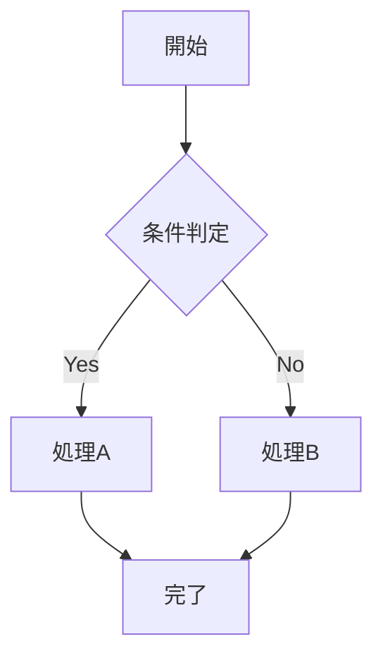

# 機能仕様書

## 目次

1. [機能一覧](#機能一覧)
2. [機能詳細](#機能詳細)

---

## 機能一覧

| 機能ID | 機能名 | 概要 | 関連US | MVP |
|--------|-------|------|--------|-----|
| F-001 | ... | ... | US-001, US-002 | ✓ |
| F-002 | ... | ... | US-003 | ✓ |
| F-003 | ... | ... | US-010 | - |

---

## 機能詳細

### F-001: [機能名]

#### 概要
<!-- この機能が解決する課題と提供する価値 -->

#### 関連ユーザーストーリー
- US-001, US-002

#### ユーザーフロー



#### 画面モックアップ

```
┌─────────────────────────────┐
│ ヘッダー                     │
├─────────────────────────────┤
│                             │
│   メインコンテンツ           │
│                             │
├─────────────────────────────┤
│ フッター                     │
└─────────────────────────────┘
```

#### 入力/出力

| 項目 | 型 | 必須 | バリデーション | 備考 |
|------|---|------|---------------|------|
| field1 | string | ✓ | 最大100文字 | ... |
| field2 | number | - | 0以上 | ... |

#### ビジネスルール

1. **ルール名1**:
   - 条件: ...
   - 結果: ...

2. **ルール名2**:
   - 条件: ...
   - 結果: ...

#### エッジケース・エラー処理

| ケース | 条件 | 対応 |
|--------|------|------|
| 入力エラー | バリデーション失敗 | エラーメッセージ表示 |
| タイムアウト | 30秒超過 | リトライ促進 |
| 権限エラー | 未認証 | ログイン画面へ遷移 |

#### 技術的考慮事項

- **API設計**: ...
- **データモデル**: ...
- **外部連携**: ...
- **キャッシュ戦略**: ...

---

### F-002: [機能名]

<!-- 同様の構造で記述 -->

---

### F-003: [機能名]

<!-- 同様の構造で記述 -->
