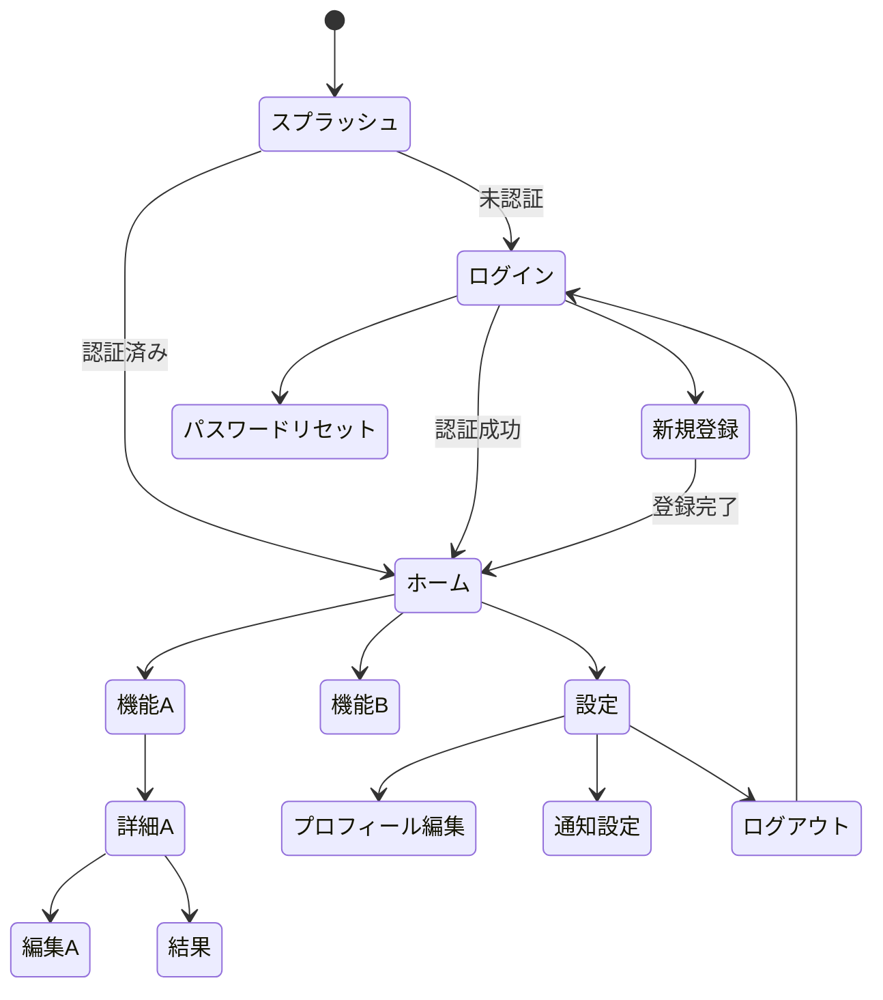

# 画面遷移図

## 全体遷移図



## 画面一覧

| 画面ID | 画面名 | 説明 | 遷移元 | 遷移先 | MVP |
|--------|-------|------|--------|--------|-----|
| SCR-001 | スプラッシュ | 起動画面 | - | ログイン/ホーム | ✓ |
| SCR-002 | ログイン | 認証画面 | スプラッシュ | ホーム/新規登録 | ✓ |
| SCR-003 | 新規登録 | ユーザー登録 | ログイン | ホーム | ✓ |
| SCR-004 | ホーム | メイン画面 | ログイン | 各機能 | ✓ |
| SCR-005 | 機能A | ... | ホーム | 詳細A | ✓ |
| SCR-006 | 詳細A | ... | 機能A | 編集A | ✓ |
| SCR-007 | 設定 | 設定画面 | ホーム | 各設定項目 | ✓ |
| ... | ... | ... | ... | ... | ... |

## ナビゲーション構造

### ボトムナビゲーション（モバイル）

```
BottomNavigation
├── ホーム (SCR-004)
├── 検索 (SCR-010)
├── 作成 (SCR-015)
├── 通知 (SCR-020)
└── マイページ (SCR-025)
```

### サイドメニュー（Web）

```
SideMenu
├── ダッシュボード
├── 機能A
│   ├── サブ機能A-1
│   └── サブ機能A-2
├── 機能B
├── 設定
│   ├── プロフィール
│   ├── 通知
│   └── セキュリティ
└── ヘルプ
```

## 画面詳細

### SCR-001: スプラッシュ

**目的**: アプリ起動時の初期化処理中に表示

**要素**:
- ロゴ
- ローディングインジケーター

**遷移条件**:
- 認証済み → ホーム
- 未認証 → ログイン

---

### SCR-002: ログイン

**目的**: ユーザー認証

**要素**:
- メールアドレス入力
- パスワード入力
- ログインボタン
- 新規登録リンク
- パスワードリセットリンク
- SNSログインボタン（任意）

**バリデーション**:
- メール形式チェック
- パスワード必須チェック

---

### SCR-004: ホーム

**目的**: メインダッシュボード

**要素**:
- ヘッダー（ロゴ、通知アイコン）
- メインコンテンツエリア
- ボトムナビゲーション

**表示データ**:
- ...

---

<!-- 他の画面も同様に記述 -->
