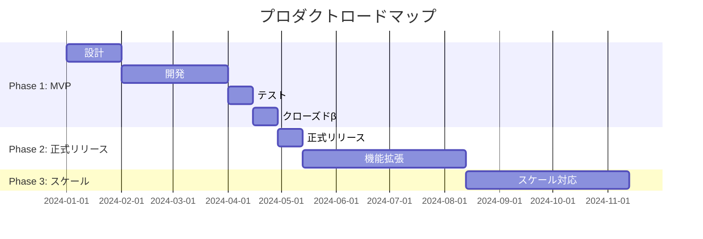

# ロードマップ

## 全体像

---

## Phase 1: MVP

### 目標

- **仮説検証**: [検証したい仮説]
- **成功基準**: [具体的な数値目標]
  - 例: クローズドβで100名獲得、NPS 40以上

### 含まれる機能

| 機能 | ユーザーストーリー | 優先度 | 備考 |
|------|------------------|--------|------|
| 機能A | US-001, US-002 | Must | コア機能 |
| 機能B | US-003 | Must | コア機能 |
| 機能C | US-004 | Should | 差別化ポイント |

### マイルストーン

| マイルストーン | 目標日 | 成果物 | 状態 |
|---------------|--------|--------|------|
| 設計完了 | MM/DD | 仕様書、デザイン | - |
| 開発完了 | MM/DD | 動作するアプリ | - |
| テスト完了 | MM/DD | テスト報告書 | - |
| クローズドβ開始 | MM/DD | β版リリース | - |

### MVP後の検証項目

- [ ] ユーザーは課題を認識しているか
- [ ] ソリューションは課題を解決しているか
- [ ] 継続利用する意思があるか
- [ ] 支払い意思があるか

---

## Phase 2: 正式リリース・機能拡張

### 目標

- **ユーザー獲得**: [目標数]
- **収益化開始**: [課金開始]

### 追加機能

| 機能 | ユーザーストーリー | 根拠 | 優先度 |
|------|------------------|------|--------|
| 機能D | US-010 | MVP feedback | 高 |
| 機能E | US-011 | 競合差別化 | 高 |
| 機能F | US-012 | ユーザー要望 | 中 |

### マイルストーン

| マイルストーン | 目標日 | 成果物 |
|---------------|--------|--------|
| 正式リリース | MM/DD | v1.0 |
| 機能D追加 | MM/DD | v1.1 |
| 機能E追加 | MM/DD | v1.2 |

---

## Phase 3: スケール

### 目標

- **MAU [目標数]達成**
- **黒字化**
- **新規市場展開**

### 取り組み

| 項目 | 内容 | 優先度 |
|------|------|--------|
| パフォーマンス最適化 | 大規模トラフィック対応 | 高 |
| 多言語対応 | 英語対応 | 中 |
| 新規市場展開 | 海外展開 | 中 |
| エンタープライズ機能 | B2B対応 | 低 |

---

## 検討中（Backlog）

将来的に実装を検討する機能。優先度・時期は未定。

| アイデア | 説明 | ユーザー価値 | 複雑度 |
|---------|------|-------------|--------|
| アイデア1 | ... | ... | 高 |
| アイデア2 | ... | ... | 中 |
| アイデア3 | ... | ... | 低 |

---

## バージョン履歴

| バージョン | リリース日 | 主な変更点 |
|-----------|-----------|-----------|
| v1.0 | YYYY/MM/DD | 正式リリース |
| v1.1 | YYYY/MM/DD | 機能D追加 |
| v1.2 | YYYY/MM/DD | 機能E追加 |

---

## ロードマップ更新履歴

| 日付 | 変更内容 | 理由 |
|------|---------|------|
| YYYY/MM/DD | 初回作成 | - |
| YYYY/MM/DD | Phase 2に機能G追加 | ユーザー要望 |
